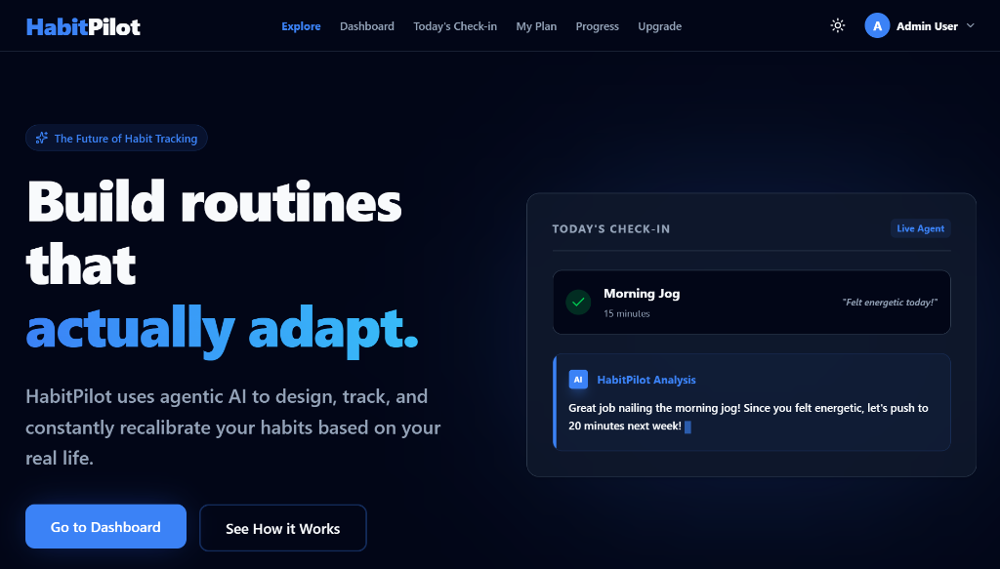

# HabitPilot Client (Frontend)

[](https://habitpilot-client.vercel.app)
[](https://nextjs.org/)
[](https://react.dev/)

An AI-driven, adaptable habit tracking application built using Next.js. HabitPilot uses agentic AI models on the backend to design, analyze, and constantly recalibrate user habit routines based on real-world feedback.

Live Application: [https://habitpilot-client.vercel.app](https://habitpilot-client.vercel.app)

---

## 📸 Interface Preview



---

## 🚀 Core Features

- **Dynamic Landing Page:** Sleek, dark-themed presentation with premium micro-animations (powered by Framer Motion) and interactive live user statistics.
- **AI Onboarding & Plan Generator:** Users complete a step-by-step onboarding questionnaire to generate tailor-made habit plans suited to their lifestyle.
- **Interactive Dashboard:** Log habits daily, track check-ins, view stats, and access AI analysis for suggestions.
- **Public Habit Explore Feed:** A public catalog of pre-generated AI plans that users can explore, clone, and customize.
- **Interactive User Profile:** Upload custom profile pictures (leveraging ImgBB API), update display name, and securely reset passwords.
- **Authenticated Dropdown Menu:** Premium glassmorphic navigation header showing current plan details and profile controls.
- **Admin Control Panel:** Restricted panel featuring:
  - **Revenue Analytics:** Estimated Monthly Recurring Revenue (MRR) calculation.
  - **Growth Graphs:** User signup history charts (using Recharts).
  - **User Management Table:** Administrative controls to lock/unlock accounts or manually adjust subscription tiers.
- **Google OAuth & Demo Login:** Flexible authentication flows using standard credentials or Google identity services.

---

## 🛠️ Tech Stack & Technologies Used

- **Framework:** Next.js 16.2 (App Router)
- **UI & Logic:** React 19, TypeScript
- **Styling:** TailwindCSS 4.0, Vanilla CSS
- **State & Querying:** React Context API, TanStack React Query v5
- **HTTP Client:** Axios (configured with production cross-origin interceptors)
- **Animations:** Framer Motion
- **Icons:** Lucide React
- **Charts:** Recharts
- **OAuth:** @react-oauth/google

---

## 📦 Dependencies List

Key dependencies configured in `package.json`:
- `next`: `16.2.10`
- `react`: `19.2.4`
- `react-dom`: `19.2.4`
- `@react-oauth/google`: `^0.13.5`
- `@tanstack/react-query`: `^5.101.2`
- `axios`: `^1.18.1`
- `framer-motion`: `^12.42.2`
- `lucide-react`: `^1.25.0`
- `recharts`: `^3.9.2`
- `tailwindcss`: `^4`
- `next-themes`: `^0.4.6`

---

## 💻 Local Development Setup

To run the frontend project locally:

### 1. Prerequisites
Ensure you have **Node.js** (v18+) and **npm** installed on your system.

### 2. Clone and Navigate
```bash
git clone https://github.com/actuallyayon/habitpilot-client.git
cd habitpilot-client
```

### 3. Install Dependencies
```bash
npm install
```

### 4. Configure Environment Variables
Create a file named `.env.local` in the root directory and define the backend API URL and Google client ID:
```env
NEXT_PUBLIC_API_URL=http://localhost:5000/api
NEXT_PUBLIC_GOOGLE_CLIENT_ID=your-google-client-id.apps.googleusercontent.com
```

### 5. Start Development Server
```bash
npm run dev
```
Open [http://localhost:3000](http://localhost:3000) in your browser.
